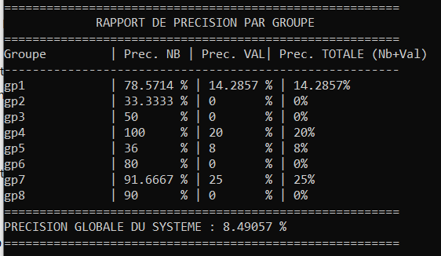
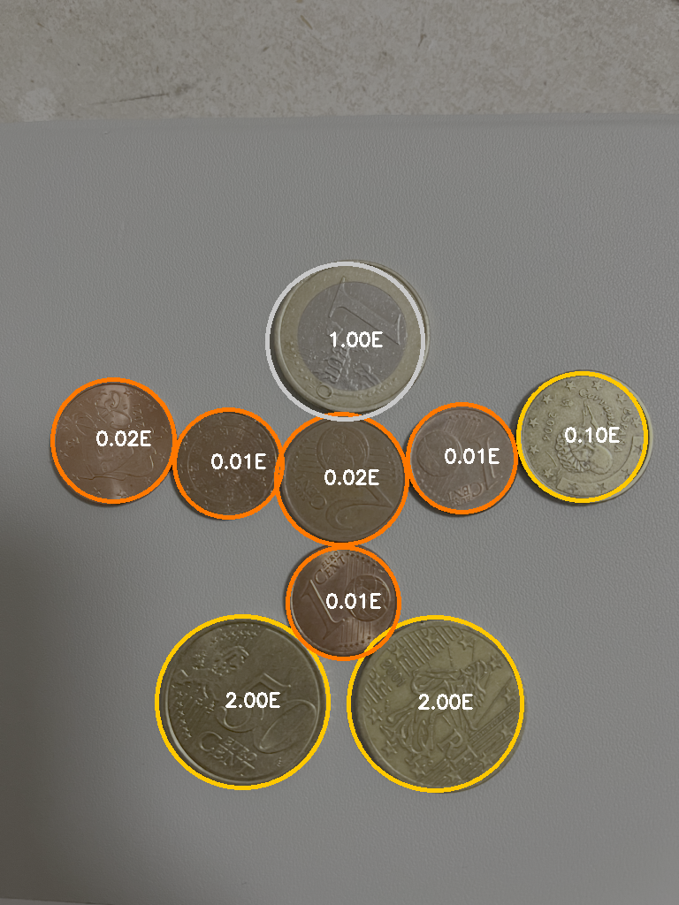
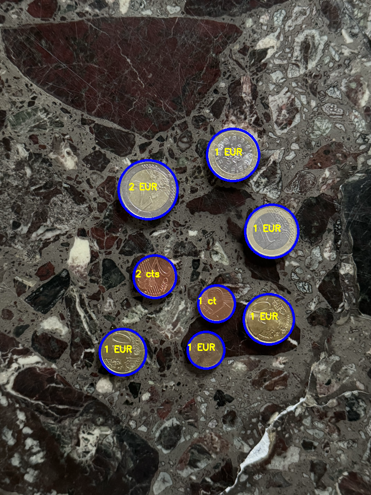
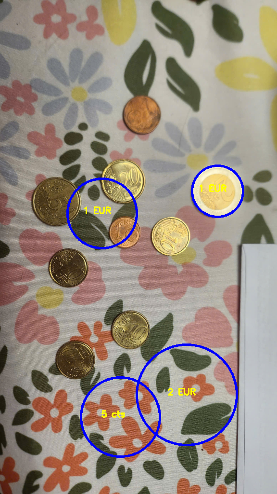

# Projet Vision : Détection, Identification et Comptage de Pièces d'Euros

**Contexte** : Le projet repose sur l'analyse d'images représentant un ensemble de pièces de monnaie en euros. Les photographies ont été capturées par un appareil mobile standard (téléphone) en vue de dessus (plongée). Les pièces sont disposées sur une table présentant des fonds de natures diverses (homogènes, texturés, à motifs).
**Objectif** : Concevoir et implémenter un algorithme de vision par ordinateur capable, à partir d'une simple image en entrée, de :
- **Détecter et compter** le nombre total de pièces présentes.
- **Identifier** la valeur de chaque pièce.
- **Estimer** la somme totale en euros représentée sur l'image.
  
# Méthodologie
L'approche finale repose sur un pipeline de traitement adaptatif qui ajuste ses paramètres en fonction de la complexité de l'image.
- **Segmentation adaptative en fonction de la texture**
  Au lieu d'un filtrage statique, le système analyse d'abord la scène :
  - **Ecart-type (StdDev)** : Définition : Mesure statistique de la dispersion des niveaux de gris.
    - Si StdDev est grand, application d'un **Filtre Bilatéral** (lissage préservant les contours) pour ignorer les veines du marbre.
    - Si StdDev est moyen, combinaison d'un Filtre Médian (élimination du bruit "poivre et sel") et d'un Flou Gaussien.
    - si StdDev est petit, lissage léger pour optimiser la détection.

- **Détection de cercles (HoughCircles)**
**Transformée de Hough Circulaire** : Définition : Algorithme de détection de formes basé sur l'accumulation de votes dans un espace paramétrique. Le système utilise des paramètres de sensibilité ajustés selon le mode détecté.

- **Classification par Consensus de Ratio**
C'est le cœur du système. Plutôt que de mesurer une taille fixe en pixels (qui change selon la distance du téléphone), le système utilise une matrice de décision :
  - **Extraction de Couleur (Espace HSV)** : Définition : Teinte, Saturation, Valeur. Un masque réduit (60% du rayon) est appliqué au centre pour extraire la couleur sans subir l'influence du bord ou de l'ombre. On sépare ainsi les groupes Or, Argent, et Cuivre.
  - **Vote par Ratio** : Chaque pièce détectée est comparée à toutes les autres. On cherche quelle identité (ex: 2€ vs 50cts) minimise l'erreur globale de ratio sur toute l'image.

# Méthodes Testées et Écartées
- **Détection par Gradients Spatiaux (Gradient-Based)**
  - **Définition - Gradients (Sobel)** : Calcul de la variation d'intensité lumineuse dans les directions X et Y.
  - **Test effectué** : Accumulateur radial basé sur la direction des gradients pour valider les bords des cercles.
  - **Résultat** : Très efficace pour ignorer les ombres, mais extrêmement sensible aux textures du fond (veines du bois ou marbre) qui génèrent des faux gradients "circulaires".

- **FitCircle / FitEllipse**
  - **Définition** : Ajustement mathématique d'un cercle parfait sur un nuage de points de contours (Canny).
  - **Résultat** : Échec total dès que les pièces sont collées ou qu'une ombre fusionne avec le bord de la pièce, car le nuage de points n'est plus circulaire.

# Évaluation Quantitative des Performances
Le système a été évalué sur une base de test divisée en 8 groupes (gp1 à gp8) présentant des images de distance, luminosité et texture variée.

**Analyse des Résultats**
Les résultats démontrent une faiblesse structurelle du système liée à une approche purement mathématique sans apprentissage :
- **Asymétrie des critères** : L'algorithme parvient moyennement à trouver les pièces (jusqu'à 60% de précision de comptage), mais échoue massivement à en déduire la valeur (souvent entre 0% et 20%).
- **La Précision Globale (7.55%)** : Ce score très bas s'explique par la tolérance d'erreur millimétrique des euros. Confondre une pièce de 50 centimes (24.25mm) avec une pièce de 1€ (23.25mm) suffit à détruire la précision de la valeur, même si la pièce a été correctement comptée.

# Critique de la Solution et Défis Rencontrés
L'implémentation de ce projet a mis en lumière plusieurs obstacles majeurs inhérents au traitement d'images classique :
- **Le Compromis "Comptage vs Identification"** : Il existe un vase communicant entre les deux objectifs. Pour améliorer la précision du comptage (trouver plus de pièces), il faut rendre l'algorithme plus "permissif" (baisser les seuils de Hough). Cependant, cela capture des éléments parasites (fleurs du tapis, reflets ronds) qui, une fois passés au calcul de la valeur, génèrent des tailles et des sommes aberrantes, détruisant la précision Val.
- **Problèmes Environnementaux** :
  - **Luminosité et Reflets** : Le métal agit comme un miroir. Une forte lumière blanche peut faire apparaître une pièce en cuivre comme "Argentée". De plus, les ombres portées décalent les centres géométriques calculés par les gradients.
  - **Distance et Angle (Perspective)** : Les photographies mobiles ne sont jamais parfaitement parallèles à la table. Une légère inclinaison transforme les cercles parfaits en ellipses. L'échelle par consensus tente de corriger l'éloignement (échelle Z), mais ne compense pas la distorsion de perspective.
  - **Texture du fond** : Les fonds texturés (nappes géométriques, bois) génèrent un bruit de gradient extrêmement fort, trompant l'accumulateur spatial de l'algorithme.
En somme, il est très difficile d'obtenir une solution générale qui marche dans tous les cas.

# Axes d'Amélioration
Pour dépasser ce plafond de verre de 8% de précision globale, le système devrait évoluer vers des méthodes hybrides ou modernes :
- **Calibration de la caméra (Correction de perspective)** : Utiliser un objet de référence (ex: une carte de crédit) pour appliquer une transformation de perspective (homographie) afin de ramener l'image à un plan parfaitement plat avant analyse.
- **Apprentissage Profond** : Remplacer l'approche mathématique par un réseau de neurones convolutifs (CNN) tel que YOLO (You Only Look Once) ou Faster R-CNN. Ces modèles ne cherchent pas un rayon en pixels, mais apprennent les caractéristiques visuelles directes (motifs de frappe, texture, couleur relative) des pièces, devenant ainsi robustes aux changements de luminosité et d'angles.
- **Égalisation Adaptative d'Histogramme (CLAHE)** : Appliquer un pré-traitement de contraste local pour normaliser les reflets et les ombres sur la surface du métal avant le calcul colorimétrique.

Groupe 7 : Zakaria HAMMOUM, Rayane KHATIM, Alexandre MARSELOO

